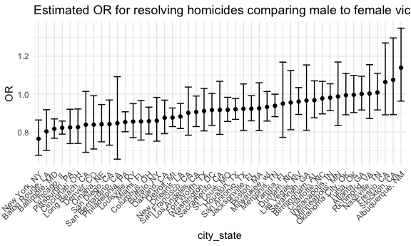
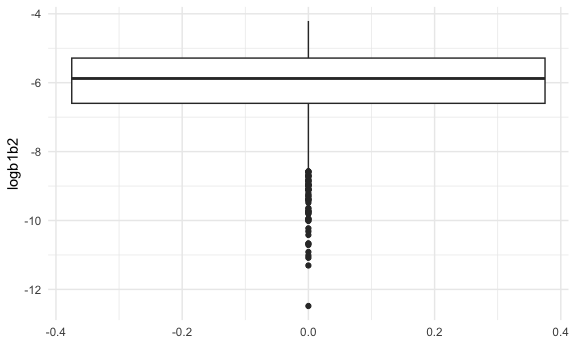
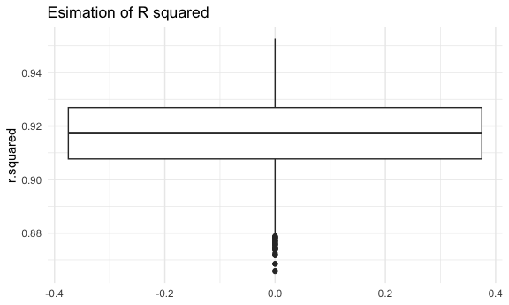

p8105_hw6_sw3879
================
Siqing Wang
2023-11-30

Load key packages.

``` r
library(tidyverse)
library(ggplot2)
```

## Problem 1

Reading and cleaning dataset

``` r
homicide_df = read_csv("data/homicide-data.csv") |> 
  janitor::clean_names() |> 
  mutate(
    city_state = paste(city, state, sep = ", "),
    resolved = as.numeric(disposition == "Closed by arrest"),
    victim_age = as.numeric(victim_age)
  ) |> 
   filter(!(city_state %in% c("Dallas, TX", "Phoenix, AZ", "Kansas City, MO", "Tulsa, AL"))) |> 
   filter(victim_race %in% c("White", "Black"))
```

    ## Rows: 52179 Columns: 12
    ## ── Column specification ────────────────────────────────────────────────────────
    ## Delimiter: ","
    ## chr (9): uid, victim_last, victim_first, victim_race, victim_age, victim_sex...
    ## dbl (3): reported_date, lat, lon
    ## 
    ## ℹ Use `spec()` to retrieve the full column specification for this data.
    ## ℹ Specify the column types or set `show_col_types = FALSE` to quiet this message.

using `glm` for logistic regression for Baltimore

``` r
baltimore_glm = homicide_df |> filter(city_state == "Baltimore, MD") |> 
  glm(resolved ~ victim_age + victim_race + victim_sex, data = _, family = binomial()) 

baltimore_glm |> 
  broom::tidy() |> 
  mutate(OR = exp(estimate),
         upperCI = exp(estimate + qnorm(.975)*std.error),
         lowerCI = exp(estimate + qnorm(.025)*std.error)) |> 
  filter(term == "victim_sexMale") |> 
  select(term, OR, upperCI, lowerCI) |> 
    knitr::kable(digits = 3)
```

| term           |    OR | upperCI | lowerCI |
|:---------------|------:|--------:|--------:|
| victim_sexMale | 0.426 |   0.558 |   0.325 |

Interpretation: In Baltimore MD, male victims have 0.426 times the odds
to have resolved case compared with female victims while all other
variables held fixed.

Using `glm` for all cities

``` r
nest_glm = homicide_df |> 
  nest(data = -city_state) |> 
  mutate(
    glm_model = map(data, \(df) glm(resolved ~ victim_age + victim_race + victim_sex, data = df)),
    glm_result = map(glm_model, broom::tidy)
  ) |> 
  select(-data, -glm_model) |> 
  unnest(glm_result) |> 
  filter(term == "victim_sexMale") |> 
  mutate(OR = exp(estimate),
         upperCI = exp(estimate + qnorm(.975)*std.error),
         lowerCI = exp(estimate + qnorm(.025)*std.error),
         city_state = fct_reorder(city_state, OR)) |>
  select(city_state, term, OR, upperCI, lowerCI)
```

Creating a plot

``` r
nest_glm |> ggplot(aes(x = city_state, y = OR)) +
  geom_point() + geom_errorbar(aes(ymin = lowerCI, ymax = upperCI)) +
  theme(axis.text.x = element_text(angle = 45, hjust = 1)) +
  labs(title = "Estimated OR for resolving homicides comparing male to female victims")
```



NYC has the lowest odd ratio while Albuquerque has the highest, meaning
that in NYC, the odds of resolved cases for male victims vs. female
victims is the lowest, and in Albuquerque the highest, while all other
factors held constant.

## Problem 2

Reading the data

``` r
weather_df = 
  rnoaa::meteo_pull_monitors(
    c("USW00094728"),
    var = c("PRCP", "TMIN", "TMAX"), 
    date_min = "2022-01-01",
    date_max = "2022-12-31") |>
  mutate(
    name = recode(id, USW00094728 = "CentralPark_NY"),
    tmin = tmin / 10,
    tmax = tmax / 10) |>
  select(name, id, everything())
```

    ## using cached file: /Users/siqingwang/Library/Caches/org.R-project.R/R/rnoaa/noaa_ghcnd/USW00094728.dly

    ## date created (size, mb): 2023-09-28 10:20:38.923515 (8.524)

    ## file min/max dates: 1869-01-01 / 2023-09-30

Setting up bootstrap function

``` r
boot_sample = function(df) {
  sample_frac(df, replace = TRUE)
}
```

Draw 5000 samples

``` r
set.seed(1)

boot_straps = 
  tibble(strap_number = 1:5000) |> 
  mutate(
    strap_sample = map(strap_number, \(i) boot_sample(weather_df))
  )
```

Do `lm` fit

``` r
boot_results = 
  boot_straps |> 
  mutate(
    models = map(strap_sample, \(df) lm(tmax ~ tmin + prcp, data = df)),
    results_tidy = map(models, broom::tidy),
    results_glance = map(models, broom::glance)
  ) |> 
  select(strap_number, results_tidy, results_glance) |> 
  unnest(results_tidy, results_glance)
```

``` r
results_logb1b2 = boot_results |> 
  select(strap_number, term, estimate, std.error) |> 
  filter(term %in% c("tmin","prcp")) |> 
  pivot_wider(
     names_from = term,
     values_from = c(estimate, std.error)
  ) |> 
  mutate(
    logb1b2 = log(estimate_tmin * estimate_prcp)
  ) 

results_rsq = boot_results |> 
  select(strap_number, r.squared) |> 
  distinct(.keep_all = TRUE)
```

Plotting estimates

``` r
results_logb1b2 |> ggplot(aes(y = logb1b2)) + geom_boxplot()
```



``` r
results_rsq |> ggplot(aes(y = r.squared)) + geom_boxplot()
```


