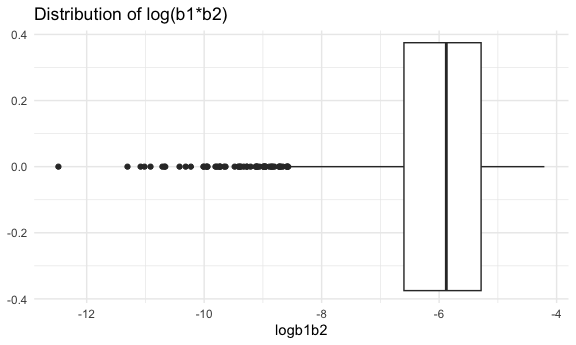

p8105_hw6_sw3879
================
Siqing Wang
2023-11-30

Load key packages.

``` r
library(tidyverse)
library(ggplot2)
```

## Problem 1

Reading and cleaning dataset

``` r
homicide_df = read_csv("data/homicide-data.csv") |> 
  janitor::clean_names() |> 
  mutate(
    city_state = paste(city, state, sep = ", "),
    resolved = as.numeric(disposition == "Closed by arrest"),
    victim_age = as.numeric(victim_age)
  ) |> 
   filter(!(city_state %in% c("Dallas, TX", "Phoenix, AZ", "Kansas City, MO", "Tulsa, AL"))) |> 
   filter(victim_race %in% c("White", "Black"))
```

    ## Rows: 52179 Columns: 12
    ## ── Column specification ────────────────────────────────────────────────────────
    ## Delimiter: ","
    ## chr (9): uid, victim_last, victim_first, victim_race, victim_age, victim_sex...
    ## dbl (3): reported_date, lat, lon
    ## 
    ## ℹ Use `spec()` to retrieve the full column specification for this data.
    ## ℹ Specify the column types or set `show_col_types = FALSE` to quiet this message.

using `glm` for logistic regression for Baltimore

``` r
baltimore_glm = homicide_df |> filter(city_state == "Baltimore, MD") |> 
  glm(resolved ~ victim_age + victim_race + victim_sex, data = _, family = binomial()) 

baltimore_glm |> 
  broom::tidy() |> 
  mutate(OR = exp(estimate),
         upperCI = exp(estimate + qnorm(.975)*std.error),
         lowerCI = exp(estimate + qnorm(.025)*std.error)) |> 
  filter(term == "victim_sexMale") |> 
  select(term, OR, upperCI, lowerCI) |> 
    knitr::kable(digits = 3)
```

| term           |    OR | upperCI | lowerCI |
|:---------------|------:|--------:|--------:|
| victim_sexMale | 0.426 |   0.558 |   0.325 |

Interpretation: In Baltimore MD, male victims have 0.426 times the odds
to have resolved case compared with female victims while all other
variables held fixed.

Using `glm` for all cities

``` r
nest_glm = homicide_df |> 
  nest(data = -city_state) |> 
  mutate(
    glm_model = map(data, \(df) glm(resolved ~ victim_age + victim_race + victim_sex, data = df)),
    glm_result = map(glm_model, broom::tidy)
  ) |> 
  select(-data, -glm_model) |> 
  unnest(glm_result) |> 
  filter(term == "victim_sexMale") |> 
  mutate(OR = exp(estimate),
         upperCI = exp(estimate + qnorm(.975)*std.error),
         lowerCI = exp(estimate + qnorm(.025)*std.error),
         city_state = fct_reorder(city_state, OR)) |>
  select(city_state, term, OR, upperCI, lowerCI)
```

Creating a plot

``` r
nest_glm |> ggplot(aes(x = city_state, y = OR)) +
  geom_point() + geom_errorbar(aes(ymin = lowerCI, ymax = upperCI)) +
  theme(axis.text.x = element_text(angle = 45, hjust = 1)) +
  labs(title = "Estimated OR for resolving homicides comparing male to female victims")
```


NYC has the lowest odd ratio while Albuquerque has the highest, meaning
that in NYC, the odds of resolved cases for male victims vs. female
victims is the lowest, and in Albuquerque the highest, while all other
factors held constant.

## Problem 2

Reading the data

``` r
weather_df = 
  rnoaa::meteo_pull_monitors(
    c("USW00094728"),
    var = c("PRCP", "TMIN", "TMAX"), 
    date_min = "2022-01-01",
    date_max = "2022-12-31") |>
  mutate(
    name = recode(id, USW00094728 = "CentralPark_NY"),
    tmin = tmin / 10,
    tmax = tmax / 10) |>
  select(name, id, everything())
```

    ## using cached file: /Users/siqingwang/Library/Caches/org.R-project.R/R/rnoaa/noaa_ghcnd/USW00094728.dly

    ## date created (size, mb): 2023-09-28 10:20:38.923515 (8.524)

    ## file min/max dates: 1869-01-01 / 2023-09-30

Setting up bootstrap function

``` r
boot_sample = function(df) {
  sample_frac(df, replace = TRUE)
}
```

Draw 5000 samples

``` r
set.seed(1)

boot_straps = 
  tibble(strap_number = 1:5000) |> 
  mutate(
    strap_sample = map(strap_number, \(i) boot_sample(weather_df))
  )
```

Do `lm` fit

``` r
boot_results = 
  boot_straps |> 
  mutate(
    models = map(strap_sample, \(df) lm(tmax ~ tmin + prcp, data = df)),
    results_tidy = map(models, broom::tidy),
    results_glance = map(models, broom::glance)
  ) |> 
  select(strap_number, results_tidy, results_glance) |> 
  unnest(results_tidy, results_glance)
```

``` r
results_logb1b2 = boot_results |> 
  select(strap_number, term, estimate, std.error) |> 
  filter(term %in% c("tmin","prcp")) |> 
  pivot_wider(
     names_from = term,
     values_from = c(estimate, std.error)
  ) |> 
  mutate(
    logb1b2 = log(estimate_tmin * estimate_prcp)
  ) 

results_rsq = boot_results |> 
  select(strap_number, r.squared) |> 
  distinct(.keep_all = TRUE)
```

Plotting estimates

``` r
results_logb1b2 |> ggplot(aes(y = logb1b2)) + geom_boxplot() +
  labs(title = "Estimation of log(b1*b2)")
```



The 95% CI for log(b1\*b2)

``` r
results_logb1b2 |> summarise(
  upperCI = quantile(logb1b2, 0.975, na.rm = TRUE),
  lowerCI = quantile(logb1b2, 0.025, na.rm = TRUE)) |> 
  knitr::kable()
```

|   upperCI |   lowerCI |
|----------:|----------:|
| -4.601673 | -8.981559 |

``` r
results_rsq |> ggplot(aes(y = r.squared)) + geom_boxplot() + 
  labs(title = "Esimation of R squared")
```


The 95% CI for r-squared

``` r
results_rsq |> summarise(
  upperCI = quantile(r.squared, 0.975, na.rm = TRUE),
  lowerCI = quantile(r.squared, 0.025, na.rm = TRUE)) |> 
  knitr::kable()
```

|   upperCI |   lowerCI |
|----------:|----------:|
| 0.9406812 | 0.8885495 |

The estimated R squared value is close to 1, meaning there is a high
percentage in the variance of `tmax` that can be explained by the
relationship with the predictors `tmin` and `prcp`.

COMMENT Significant amount of NaN values in log(b1\*b2) due to negative
precipitation values.

## Problem 3

Reading and cleaning data

``` r
bwt_df = read_csv("data/birthweight.csv") |> 
  janitor::clean_names() |> 
  mutate(
    babysex = factor(babysex, levels = c(1, 2), labels = c("male", "female")),
    frace = factor(frace, levels = c(1, 2, 3, 4, 8, 9), labels = c("White", "Black", "Asian", "Puerto Rican", "Other", "Unknown")),
  mrace = factor(mrace, levels = c(1, 2, 3, 4, 8, 9), labels = c("White", "Black", "Asian", "Puerto Rican", "Other", "Unknown")),
  malform = factor(malform, levels = c(0, 1), labels = c("absent", "present"))
  )
```

    ## Rows: 4342 Columns: 20
    ## ── Column specification ────────────────────────────────────────────────────────
    ## Delimiter: ","
    ## dbl (20): babysex, bhead, blength, bwt, delwt, fincome, frace, gaweeks, malf...
    ## 
    ## ℹ Use `spec()` to retrieve the full column specification for this data.
    ## ℹ Specify the column types or set `show_col_types = FALSE` to quiet this message.

My hypothesis is that birth weight is associated with presence of
malformation `malform` and mother’s weight gain during pregnancy
`wtgain`, since I hypothesize pregnant mom with greater weight gain may
have babies that weigh more, and those who don’t have malformation might
have higher weight. I will use MLR to fit `malform` and `wtgain` as
predictor, and `bwt` as outcome. I will also include an interaction
term.

``` r
q3m1 = lm(bwt ~ malform + wtgain + malform*wtgain, data = bwt_df)

broom::tidy(q3m1)
```

    ## # A tibble: 4 × 5
    ##   term                  estimate std.error statistic  p.value
    ##   <chr>                    <dbl>     <dbl>     <dbl>    <dbl>
    ## 1 (Intercept)             2857.     17.0      168.   0       
    ## 2 malformpresent           466.    300.         1.56 1.20e- 1
    ## 3 wtgain                    11.7     0.690     16.9  3.39e-62
    ## 4 malformpresent:wtgain    -18.8     9.76      -1.92 5.44e- 2

Plotting residuals agains fitted value for my model:

``` r
bwt_df |> modelr::add_predictions(q3m1) |> 
  modelr::add_residuals(q3m1) |> 
  ggplot(aes(x = pred, y = resid)) + geom_point() +
  labs(title = "MLR of birth weight with malformations and weight gain")
```


Now comparing with the other two given models:

``` r
q3model2 = lm(bwt ~ blength + gaweeks, data = bwt_df)
broom::tidy(q3model2)
```

    ## # A tibble: 3 × 5
    ##   term        estimate std.error statistic  p.value
    ##   <chr>          <dbl>     <dbl>     <dbl>    <dbl>
    ## 1 (Intercept)  -4348.      98.0      -44.4 0       
    ## 2 blength        129.       1.99      64.6 0       
    ## 3 gaweeks         27.0      1.72      15.7 2.36e-54

``` r
q3model3 = lm(bwt ~ bhead + blength + babysex + bhead*blength + bhead*babysex + blength*babysex + bhead*blength*babysex, data = bwt_df)
broom::tidy(q3model3)
```

    ## # A tibble: 8 × 5
    ##   term                         estimate std.error statistic      p.value
    ##   <chr>                           <dbl>     <dbl>     <dbl>        <dbl>
    ## 1 (Intercept)                 -7177.     1265.       -5.67  0.0000000149
    ## 2 bhead                         182.       38.1       4.78  0.00000184  
    ## 3 blength                       102.       26.2       3.90  0.0000992   
    ## 4 babysexfemale                6375.     1678.        3.80  0.000147    
    ## 5 bhead:blength                  -0.554     0.780    -0.710 0.478       
    ## 6 bhead:babysexfemale          -198.       51.1      -3.88  0.000105    
    ## 7 blength:babysexfemale        -124.       35.1      -3.52  0.000429    
    ## 8 bhead:blength:babysexfemale     3.88      1.06      3.67  0.000245

``` r
cv_df = 
  bwt_df |> 
  modelr::crossv_mc(n = 100) |> 
  mutate(
    train = map(train, as_tibble),
    test = map(test, as_tibble)
  )

cv_results = cv_df |> mutate(
  q3m1 = map(train, \(df) lm(bwt ~ malform + wtgain + malform*wtgain, data = df)),
  q3m2 = map(train, \(df) lm(bwt ~ blength + gaweeks, data = df)),
  q3m3 = map(train, \(df) lm(bwt ~ bhead + blength + babysex + bhead*blength + bhead*babysex + blength*babysex + bhead*blength*babysex, data = df))
  )|> 
    mutate(
    rmse_q3m1 = map2_dbl(q3m1, test, \(mod, df) modelr::rmse(mod, df)),
    rmse_q3m2 = map2_dbl(q3m2, test, \(mod, df) modelr::rmse(mod, df)),
    rmse_q3m3 = map2_dbl(q3m3, test, \(mod, df) modelr::rmse(mod, df))
    )

cv_results |> 
  select(starts_with("rmse")) |> 
  pivot_longer(
    everything(),
    names_to = "model_type",
    values_to = "rmse",
    names_prefix = "rmse_"
  ) |> 
  group_by(model_type) |> 
  summarize(m_rmse = mean(rmse))
```

    ## # A tibble: 3 × 2
    ##   model_type m_rmse
    ##   <chr>       <dbl>
    ## 1 q3m1         497.
    ## 2 q3m2         335.
    ## 3 q3m3         290.

Plot the RMSE for all three models

``` r
cv_results |> 
  select(starts_with("rmse")) |> 
  pivot_longer(
    everything(),
    names_to = "model_type",
    values_to = "rmse",
    names_prefix = "rmse_"
  ) |> 
  ggplot(aes(x = model_type, y = rmse)) +
  geom_violin() +
  labs(title = "Comparison between my model (q3m1) and 2 given models")
```


The 2 alternative models are significantly better than the model I
proposed due to the lower RMSE.
